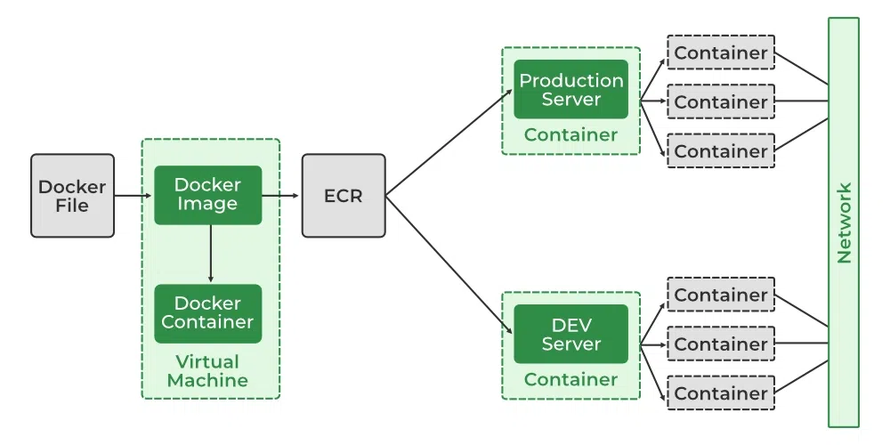

1. **Document Key Terminologies:**
   - In your `solution.md`, list and briefly describe key Docker terms such as image, container, Dockerfile, volume, and network.
   - Explain the main Docker components (Docker Engine, Docker Hub, etc.) and how they interact.

- Docker image

  - Docker Image is an executable package of software that includes everything needed to run an application.
    
  - Docker images are built using the dockerfile which consists of a sets of instructions which will containerized the applicaiton.
  - docker images are lightweight and portable
    components of docker image
  - layers: filesystem stacked to form a complete image
  - base image: foundation often a minimal operating system (OS).
  - Dockerfile: a textfile containing set of instructions to build a docker image.
  - tags: Labels given to images for versioning
  - iMage ID: uniques identifier for each docker image.

  - command to create a docker image from dockerfile
    `docker build -t your_docker_image -f path/to/dockerfile`
    eg: `docker build -t docker_node -f . `
  - verify a docker image build
    `docker images`
  - commadn to delete a docker image
    ` docker rmi image_name`

- Docker Container
- a container isa standaed unit od software that packages up code and all its so that applicaiton runs quickly and reliably from one computer enviroment to another

  - container are designs to isolate applicaitons and their dependencies ensuring that they can run consistently across differnt enviroment.
  - whether application is running from your computer or running from the cloud the behaviour will remain the same.

- container run on top of a shared operating system provided by HOST system means container uses single OS to create virtual application and its libraries.

Beneifts of using Container:

1. portability: containers are platform independent They can run on any system that supports the container runtime, such as Docker, regardless of the underlying operating system.
2. Efficency: Containers share the host system's operating system which reduces the overhead of running a virtual machine with multiple operating systems.
3. Consistency: Containers package all the necessary components, including the application code, runtime, libraries, and dependencies, into a single unit.
4. Isolation: Containers provide a lightweight and isolated environment for running applications.
5. Fast Deployment: Containers can be created and started quickly, often in a matter of seconds

- DockerFile
  A dockerfile is a text file containing a set of instructions that are used to create a dockerimage, It defines everything to build and run a containerized applicaiton

- The base image to use
- The dependencies to install
- The application code to copy
- The commands to execute when the container start

- how to write a docker file

  #### Use the official Node.js base image

      FROM node:22-alpine

#### Set the working directory inside the container

      WORKDIR /app

#### Copy package.json and package-lock.json to install dependencies first

    COPY package.json package-lock.json ./

#### Install only production dependencies

    RUN npm install --only=production

#### Copy the rest of the application code

    COPY . .

#### Expose port 5000 (same as the Node.js server)

    EXPOSE 5000

#### Command to run the application

    CMD ["node", "server.js"]

- now to build the image out of this dockerfile
  `docker build -t docker_image_name_here path`
  eg: `docker build -t node_docker .`
- now run this image to build the container
  `docker run -d -p 5000:5000 node_docker`
- to verify the container is running
  `docker ps`
- to check logs of a particular container
  `docker logs <container_id>`

- Docker Volume

  - Docker Volumes are a popular and effective method for assuring data permanence while working in containers. Docker volumes are file systems that are mounted on Docker containers to preserve the data generated by the container.

- command to create a docker volume
  `docker volume create Your_volume_name`
- command to mount the docker volume with docker container
  `docker run -d -e volume_name:/path of container container_name`

  - Docker network

  1.  Container networking refers to the ability for containers to connect to and communicate with each other, or to non-Docker workloads.
  2.  A network is a group of two or more devices that can communicate with each other either physically or virtually.
  3.  The Docker network is a virtual network created by Docker to enable communication between Docker containers.
  4.  If two containers are running on the same host they can communicate with each other without the need for ports to be exposed to the host machine.

  - command to get a list of network available
    `docker network ls`
  - Types of Network Driver

    1. Bridge:The default network driver.
    2. Host:Remove isolation(network isolation) between the container and docker host.
    3. NONE: Ip address won't be assign to any containers.
    4. overlay: overlay network will enable the connection between multiple Docker demons and make different Docker swarm services communicate with each other.
    5. IPVlAN: Users have complete control over both IPv4 and IPv6 addressing by using the IPvlan driver.
    6. MacVLAN: macvlan driver makes it possible to assign MAC addresses to a container.

  - command to create a docker network
    `sudo docker network create --driver <driver-name> <bridge-name>`
    eg: `sudo docker network create --driver bridge demo_network`

